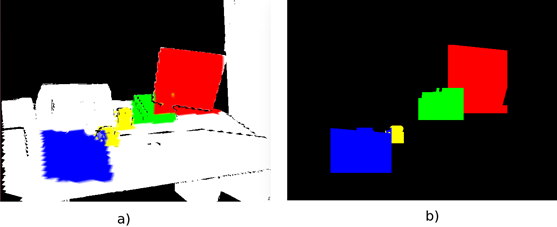
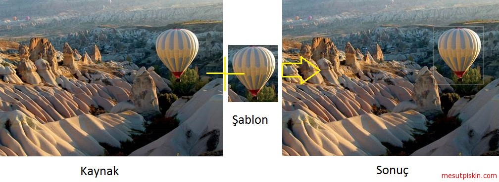
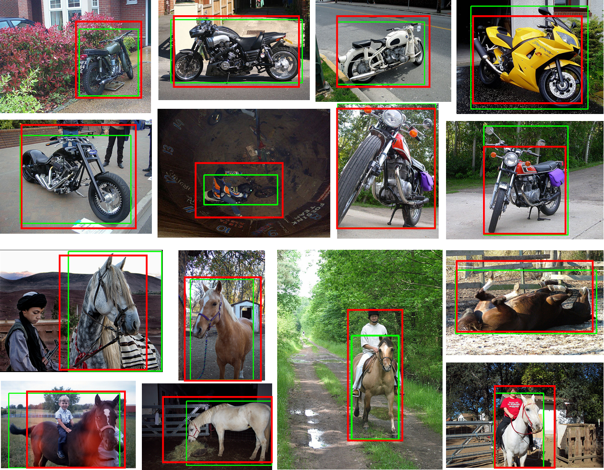
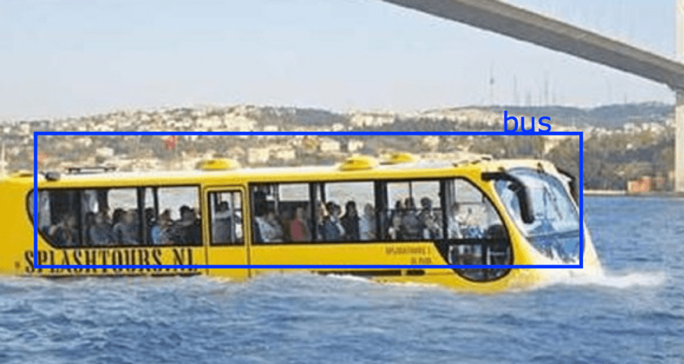

[English](./README.md) | Türkçe

<h1 align="center">OpenCV ile Nesne Tespiti</h1>

<a href="https://github.com/mesutpiskin/computer-vision-guide">Görüntü İşleme ve Bilgisayarlı Görü Kılavuzu (EN, TR)</a>

***

### Örnekler

Bu repository altında aşağıdaki yöntemlere ilişkin örnekler bulunmaktadır.

1. [Haar Cascade] - Yüz, göz, burun vb. nesne tanıma.
2. [Renk Tespiti] - Nesne rengi tespiti ve renk ile nesne takibi.
3. [Template Matching] - Template matching / Şablon eşleştirme yöntemi kullanarak nesne tespiti.
4. [Derin öğrenme] - Derin sinir ağı (DNN) ile nesne tespiti.

## Örnek 1: Yüz ve Göz Tespiti

*Kaynak kod dizini: src/FaceAndEyeDetection/*

Object detection Örneks with haar cascade classifier algorithm (Face, eyes, mouth, other objects etc.). Cascade Classifier Training http://docs.opencv.org/3.1.0/dc/d88/tutorial_traincascade.html

**What is Haar cascade?**
Haar cascade classifier
Object Detection using Haar feature-based cascade classifiers is an effective object detection method proposed by Paul Viola and Michael Jones in their paper, "Rapid Object Detection using a Boosted Cascade of Simple Features" in 2001. It is a machine learning based approach where a cascade function is trained from a lot of positive and negative images. It is then used to detect objects in other images.

**Gereksinimler**

- OpenCV 3.x Versiyon
- Java > 6 Versiyon

Face and eye detection by the camera using haar cascade algorithm.

**Video:**

## Örnek 2: Renk Tespiti ve Nesne Takibi

*Kaynak kod dizini: src/ColorBasedObjectTracker/*

An Örnek of an application where OpenCV is used to detect objects based on color differences.

**Gereksinimler**

- OpenCV >2.x Versiyon
- Java >6 Versiyon

## Örnek 3: Template Matching ile Nesne Tespiti

*Kaynak kod dizini: src/TemplateMatchingObjectDetection/*

Template matching is a technique for finding areas of an image that match (are similar) to a template image (patch).

**Gereksinimler**

- OpenCV 3.x Versiyon
- Java >6 Versiyon

My blog post for [template matching.](http://mesutpiskin.com/blog/opencv-template-matching-ile-nesne-tespiti.html)

## Örnek 4: Derin Sinir Ağı DNN ile Nesne Tespiti

*Kaynak kod dizini: src/DeepNeuralNetwork/*

- OpenCV > 3.3 Versiyon

In this tutorial you will learn how to use opencv dnn module for image classification by using MobileNetSSD_deploy trained network. My blog post for [deep neural network.](http://mesutpiskin.com/blog/opencv-derin-ogrenme-nesne-tanima.html)

[haar cascade]: #
[renk tespiti]: #
[template matching]: #
[derin öğrenme]: #